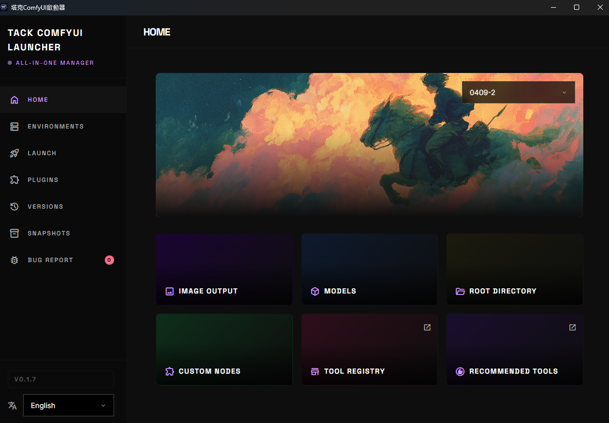

# TACK ComfyUI Launcher

**A desktop tool for managing multiple isolated ComfyUI installations.**

Create, clone, snapshot, and version-control separate ComfyUI environments — each with independent plugins, Python versions, and CUDA configurations.



[](LICENSE)
[](https://www.python.org/)
[]()

**English** | [繁體中文](README_zh-TW.md)

---

## Features

### Multi-Environment Management

- **Create** fully isolated ComfyUI environments with dedicated Python virtual environments
- **Clone** existing environments to experiment without risk
- **Rename** and **delete** environments freely
- **Merge** packages and plugins between environments (add or replace strategy)
- Each environment has its own venv, ComfyUI installation, and plugin set

### Plugin Management

- **Install** custom nodes from Git URLs with automatic dependency resolution
- **Enable / Disable** plugins by toggling directories (no data loss)
- **Update** individual plugins or batch-update all at once
- **6-step conflict analysis** before installation:
  1. Dependency extraction (requirements.txt + AST parsing of install.py)
  2. Pip dry-run simulation
  3. Version comparison against current environment
  4. Critical package detection (torch, numpy, transformers, etc.)
  5. Risk classification (GREEN / YELLOW / HIGH / CRITICAL)
  6. User-facing recommendations

### Snapshot & Rollback

- **Point-in-time snapshots** capturing pip freeze, ComfyUI commit, Python/CUDA versions, custom node states, and config backups
- **One-click restore** to any previous snapshot
- **Auto-snapshots** created before clone, merge, and version-switch operations
- Configurable max snapshots with automatic pruning

### Version Control

- Browse and switch between ComfyUI **tags** and **branches**
- View recent commit history
- Update ComfyUI to the latest version with a single click

### Launch & Runtime

- **Start / stop** ComfyUI instances per environment
- Configurable per-environment launch settings:
  - Cross-attention mode (pytorch, split, quad, sage, flash, etc.)
  - VRAM management (gpu_only, high, normal, low, cpu)
  - Network settings (listen IP, port, CORS, TLS)
  - Custom CLI arguments
- **PyTorch engine switching** — change CUDA version on the fly
- **Pre-launch diagnostics** — dependency checks, conflict detection, duplicate node scanning
- **Log viewer** with export capability
- Multiple environments can run simultaneously on different ports

### GPU & Version Detection

- Automatic GPU detection via `nvidia-smi`
- Recommended CUDA tag selection based on driver version
- Python version management (3.10 – 3.13) with embeddable builds
- PyTorch version fetching from official wheel indexes

### Self-Update

- Checks GitHub for new versions
- One-click update with progress tracking
- Automatic restart after update

### Internationalization

- Full UI support for **English** and **Traditional Chinese** (zh-TW)

---

## Screenshots

> The GUI is a modern HTML5 SPA rendered inside a PySide6 desktop window.

The application includes pages for:
- **Home** — Quick actions and folder shortcuts
- **Environments** — Create, clone, edit, delete environments
- **Launch** — Start/stop ComfyUI with advanced settings and diagnostics
- **Plugins** — Install, manage, and analyze custom nodes
- **Versions** — Browse and switch ComfyUI versions
- **Snapshots** — Create, restore, and manage snapshots

---

## Installation

### Prerequisites

- **Windows 10/11**
- **Python 3.10+** (or use the bundled embedded Python)
- **Git** (or use the bundled embedded Git)
- **NVIDIA GPU** recommended (CPU mode available)

### Quick Start

1. **Download** the latest release from [GitHub Releases](https://github.com/tackcrypto1031/tk_comfyui_start_tool/releases) or clone the repository:

   ```bash
   git clone https://github.com/tackcrypto1031/tk_comfyui_start_tool.git
   cd tk_comfyui_start_tool
   ```

2. **Install dependencies** (skip if using the bundled Python):

   ```bash
   pip install -r requirements.txt
   ```

3. **Launch the application**:

   Double-click `start.bat`, or run manually:

   ```bash
   pythonw launcher.py
   ```

4. **Create your first environment** — click "Create" in the Environments page, choose a ComfyUI version, and the tool handles venv creation, cloning, PyTorch installation, and dependency setup automatically.

### Bundled Tools

The tool can include embedded executables for zero-dependency setup:

```
tools/
├── git/cmd/git.exe        # Embedded Git
└── python/pythonw.exe     # Embedded Python
```

If these are present, the launcher uses them automatically. Otherwise, it falls back to system-installed Git and Python.

---

## Usage

### GUI Mode (Default)

Double-click `start.bat` or run:

```bash
pythonw launcher.py
```

### CLI Mode

The tool also provides a full command-line interface:

```bash
# Environment management
python launcher.py env list
python launcher.py env create my_env --branch master
python launcher.py env create my_env --tag v0.3.0
python launcher.py env clone main my_experiment
python launcher.py env delete old_env
python launcher.py env merge source_env target_env --strategy add
python launcher.py env info my_env
python launcher.py env analyze my_env path/to/custom_node

# Snapshot management
python launcher.py snapshot create my_env --reason "before major change"
python launcher.py snapshot list my_env
python launcher.py snapshot restore my_env snap-20250101-120000-000000
python launcher.py snapshot delete my_env snap-20250101-120000-000000

# Version management
python launcher.py version list my_env
python launcher.py version switch my_env v0.3.0
python launcher.py version update my_env

# Launch ComfyUI
python launcher.py launch start my_env --port 8188
python launcher.py launch stop my_env
python launcher.py launch status
```

---

## Configuration

Settings are stored in `config.json` at the project root:

| Key | Default | Description |
|-----|---------|-------------|
| `default_env` | `"main"` | Default environment name |
| `environments_dir` | `"./environments"` | Where environments are stored |
| `models_dir` | `"./models"` | Shared models directory |
| `snapshots_dir` | `"./snapshots"` | Snapshot storage |
| `max_snapshots` | `20` | Max snapshots per environment (auto-prunes oldest) |
| `auto_snapshot` | `true` | Auto-snapshot before clone/merge |
| `auto_open_browser` | `true` | Open browser after launching ComfyUI |
| `default_port` | `8188` | Default ComfyUI port |
| `theme` | `"dark"` | UI theme |
| `language` | `"zh-TW"` | UI language (`en` or `zh-TW`) |

### Shared Models

All environments share a single `models/` directory with subdirectories:

```
models/
├── checkpoints/
├── loras/
├── vae/
├── controlnet/
├── clip/
├── embeddings/
└── upscale_models/
```

The tool auto-generates `extra_model_paths.yaml` for each environment to point to this shared location.

---

## Project Structure

```
tk_comfyui_start_tool/
├── launcher.py              # Entry point (GUI or CLI)
├── cli.py                   # CLI commands (Click)
├── start.bat                # Windows GUI launcher
├── config.json              # Configuration
├── VERSION.json             # Version & update info
├── requirements.txt         # Python dependencies
├── src/
│   ├── core/                # Business logic
│   │   ├── env_manager.py       # Environment lifecycle
│   │   ├── snapshot_manager.py  # Snapshot backup & restore
│   │   ├── version_manager.py   # GPU detection, Python/CUDA mgmt
│   │   ├── version_controller.py# ComfyUI version switching
│   │   ├── conflict_analyzer.py # 6-step plugin conflict analysis
│   │   ├── comfyui_launcher.py  # Process start/stop
│   │   ├── diagnostics.py       # Dependency & conflict checks
│   │   └── updater.py           # Self-update system
│   ├── gui/
│   │   ├── bridge.py            # QWebChannel Python-JS bridge
│   │   └── web/                 # HTML5 SPA frontend
│   │       ├── index.html
│   │       ├── js/
│   │       │   ├── app.js       # SPA routing
│   │       │   ├── bridge.js    # JS API client
│   │       │   ├── i18n.js      # Translations
│   │       │   └── pages/       # Page modules
│   │       └── css/
│   ├── models/              # Data models
│   └── utils/               # Utilities (pip, git, process, fs)
├── environments/            # Runtime environments
├── models/                  # Shared model files
├── snapshots/               # Environment snapshots
└── tools/                   # Bundled Git & Python
```

---

## Architecture

The application is a **PySide6 + QWebEngineView** hybrid desktop app. The frontend is an HTML5 SPA that communicates with the Python backend through **QWebChannel**.

```
┌─────────────────────────────────────────────┐
│                  PySide6 Window              │
│  ┌───────────────────────────────────────┐  │
│  │         QWebEngineView (SPA)          │  │
│  │  ┌─────────┐  ┌───────────────────┐   │  │
│  │  │ Sidebar  │  │   Page Content    │   │  │
│  │  │  Nav     │  │                   │   │  │
│  │  └─────────┘  └───────────────────┘   │  │
│  └──────────────┬────────────────────────┘  │
│                 │ QWebChannel                │
│  ┌──────────────┴────────────────────────┐  │
│  │          Bridge (Python)              │  │
│  │  EnvManager | Launcher | Snapshots    │  │
│  │  Versions   | Plugins  | Updater      │  │
│  └───────────────────────────────────────┘  │
└─────────────────────────────────────────────┘
```

Long-running operations use an async worker pattern: the bridge returns a `request_id` immediately, and the frontend polls for progress and results.

---

## Development

### Running Tests

```bash
# All tests
pytest

# With coverage
pytest --cov

# Specific test file
pytest tests/test_core/test_env_manager.py

# Pattern matching
pytest -k test_create
```

### Dependencies

| Package | Purpose |
|---------|---------|
| PySide6 | Desktop window & QWebChannel |
| click | CLI framework |
| rich | CLI formatting |
| gitpython | Git operations |
| psutil | Process management |
| pyyaml | YAML config files |
| packaging | Version comparison |
| requests | HTTP requests |

---

## License

This project is licensed under the **Apache License 2.0** — see the [LICENSE](LICENSE) file for details.

---

## Links

- [GitHub Repository](https://github.com/tackcrypto1031/tk_comfyui_start_tool)
- [ComfyUI](https://github.com/comfyanonymous/ComfyUI)
